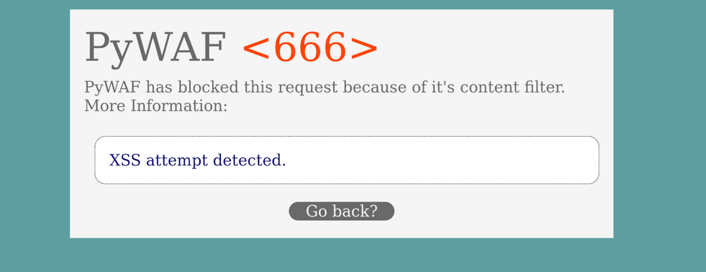
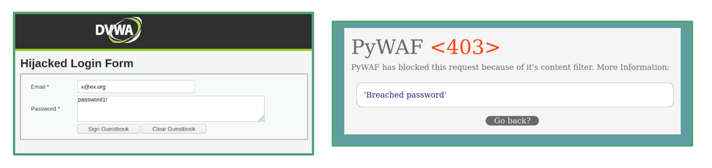
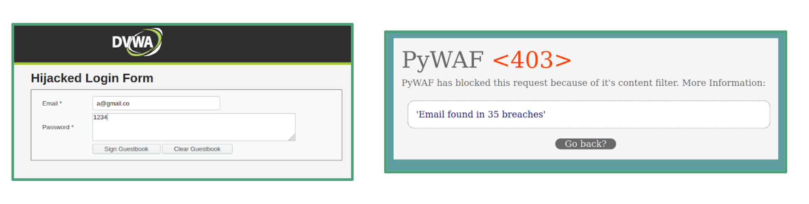

# py-waf - A python WAF

## Features
* Detects and prevents Reflected and Stored XSS attacks by dropping requests or escaping dangerous characters
* Detects and prevents SQL injections by matching form input in vulnerable forms to SQL commands and escape characters
* Prevents DoS for the web server by rate limiting
* Supports TLS with HTTPS for requests
* Adds security headers requests
* Checks for breached emails/passwords

## Screenshots
Blocked XSS



Detecting password found in a breach (using HaveIBeenPwned API)



Detecting email address found in breach



See the [PDF](artifacts/Web_Application_Firewall_pyWAF.pdf) for more pictures and information.

## Docker Hub
The project is available on docker hub [here](https://hub.docker.com/repository/docker/nineluj/py-waf).
Pull the container locally with:
```shell script
docker pull docker.io/nineluj/py-waf
```

## Setup for local development
## Running
1. Create venv for Python 3.8 (in the root directory of the project)
    ```shell script
   python --version
   > ... 3.8 ...
   python -m venv venv
    ```
2. Active the venv in your shell
    ```shell script
   source venv/bin/activate
    ```
3. Install the requirements
    ```shell script
   pip install -r requirements.txt 
   ```
   
4. Validate the config. A sample config is provided in `config/config.sample.yml`

5. Run `./run.py --config <path to config>`

### [Optional] Adding HTTPS Support
Use a tool like [minica](https://github.com/jsha/minica) to create the certificates. Make sure that the root
certificate is trusted by your OS/browser (easiest is to trust in Firefox if you use that).

After that, edit your config to include:
```yaml
use_ssl: Yes
ssl_cert: <path>.pem
ssl_key: <path>.key
```
Running the flask app again should make the server run with HTTPS.

## Testing app

### For Docker
1. Run the testing container
    ```
    docker run -it --name vuln_app -p 4040:4040 santosomar/vuln_app:latest /bin/bash
    ```
   OR 
   ```
   docker run --rm -it -p 4040:80 vulnerables/web-dvwa
   ```

2. Run the WAF
    ```shell script
   docker run -v <local>:<container> -it pywaf --config <path_to_config> 
    ```

### With Podman
1. Run the testing container
    ```shell script
    podman run -it --name vuln_app --pod new:waf -p 4040:4040 -p 9991:80 santosomar/vuln_app:latest /bin/bash
    ```
2. Run the WAF
    ```shell script
   podman run -it --pod waf -v <local>:/tmp/dir --rm pywaf -c /tmp/dir/config.yml
    ```